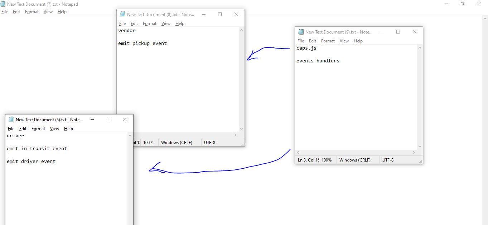

# LAB - Class 16

## Project: Event Driven Applications

### Author: Ruwaid al sayyed obeid

### Links and Resources

- [submission PR](https://github.com/ruwaid-401-advanced-javascript/caps/pull/2)
- [Github actions](https://github.com/ruwaid-401-advanced-javascript/caps/pull/2/checks)

## Modules
### caps.js
### vendor.js
### driver.js
### evens.js

### Setup
#### .env requirements
* STORENAME - name of the store
* PORT - port number

#### How to initialize/run your application 
* start server 
* start clients

#### UML

